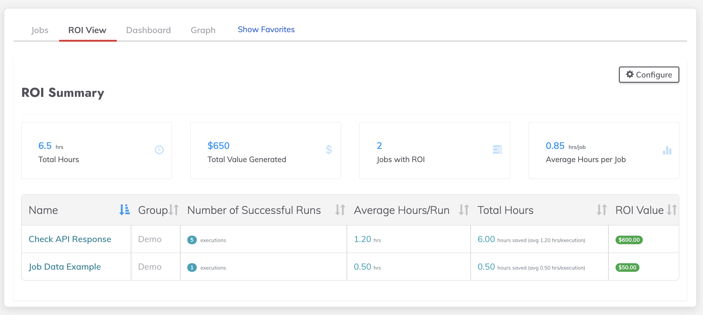
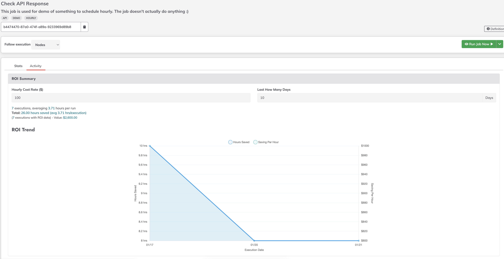

# ROI Summary Plugin for Rundeck

**Transform your automation metrics into compelling business value**

The ROI Summary plugin brings your automation's financial impact to life through intuitive visualizations and real-time calculations, helping teams quantify and demonstrate the value of their automation initiatives.


*ROI Summary Dashboard showing financial overview for project*


*Job specific ROI showing financial impact and trends*

## Versions

Current Stable Version: 1.0.0

| Plugin Version | Rundeck Version | Release Date |
|----|----|----|
| 1.0.0    | 5.0.2+    | 2025-01-31   |

**Known Issues**: 1.0.0 and prior do not work with the Alpha UI release (aka NextUI)

## Key Features

- **Dynamic ROI Dashboard**: Real-time view of cost and time savings across all automated jobs
- **Interactive Trend Analysis**: Visual tracking of automation savings over time
- **Flexible Cost Modeling**: Customizable hourly rates to match your business context
- **Real-time Calculations**: Immediate ROI updates with each successful execution
- **Executive-ready Metrics**: Designed for clear stakeholder communication

## Visualizations

- **ROI Summary Dashboard**: Overview of total savings and key metrics including:
  - **Total Hours Saved**: Cumulative time savings across all automated jobs
  - **Cost Savings**: Financial impact calculated based on configured hourly rates
  - **Execution Count**: Total number of successful automated runs
  - **Trend Analysis**: Historical view of savings growth over time

- **Jobs List View**: Comprehensive metrics for all jobs including:
  - **Individual Job ROI**: Per-job breakdown of time and cost savings
  - **Execution History**: Track record of automation success
  - **Configurable Display**: Options to show/hide jobs without ROI data

- **Individual Job View**: Detailed analysis showing:
  - **Job-specific Trends**: ROI patterns over time
  - **Execution Details**: Granular view of each run's contribution
  - **Custom Time Windows**: Flexible date range selection

## Business Benefits

- Quantify automation initiatives in financial terms
- Support data-driven automation investment decisions
- Provide clear ROI metrics for stakeholder reporting
- Track efficiency improvements over time
- Identify high-impact automation opportunities

## Requirements

- Rundeck Enterprise (Self-Hosted)
- ROI Metrics feature enabled and configured
- Job-level metric configuration:
  - Metric name: `hours`
  - Value: estimated time saved per execution
- [Detailed ROI Metrics setup guide](https://docs.rundeck.com/docs/learning/howto/use-roi-metrics.html)

## Configuration

The plugin supports configuration through:
- Job-level ROI metric settings
- Dashboard time window adjustments
- Hourly rate customization

Default settings:
- Time Window: 30 days
- Metric Name: hours

## Usage

1. Configure ROI metrics on your automated jobs
2. Navigate to the ROI Summary dashboard
3. View overall savings metrics
4. Analyze trends through interactive charts
5. Drill down to individual job details
6. Adjust time windows for different perspectives

## Build

Using gradle:
```bash
./gradlew clean build
```

## Install

```
cp build/distributions/ui-roi-summary-0.1.0.zip $RDECK_BASE/libext
```

No restart required after installation.

## Known Issues/Limitations
- Not compatible with Alpha UI/NextUI
- Requires Enterprise Self-Hosted (not available on Cloud)
- ROI calculations depend on accurate time savings estimates

## Support
- Documentation: [ROI Metrics Guide](https://docs.rundeck.com/docs/learning/howto/use-roi-metrics.html)
- Issues: This is Community supported only.  Please report any issues via the GitHub repository