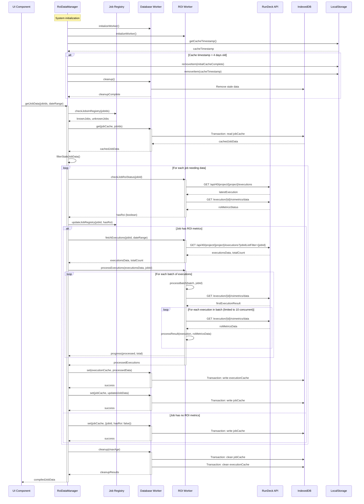

# ROI Summary Plugin Flow

This document provides a sequence diagram and explanation of the data flow in the ROI Summary plugin.

## Sequence Diagram

## Explanation of Data Flow

1. **System Initialization**:
   - RoiDataManager initializes the Database Worker and ROI Worker
   - Checks localStorage for cache timestamp
   - If timestamp is older than 4 days:
     - Removes localStorage flags (initialCacheComplete, cacheTimestamp)
     - Triggers targeted cleanup of stale data in IndexedDB
   - Restores job registry from IndexedDB if enabled

2. **Initial Request**: The UI Component requests ROI data for specific jobs, optionally with a date range filter.

2. **Job Registry Check**:
   - RoiDataManager first checks the job registry to see which jobs are known to have or not have ROI data
   - This optimizes the process by skipping jobs that don't have ROI metrics

3. **Cache Check**:
   - Database Worker queries IndexedDB for cached job and execution data
   - RoiDataManager filters out stale data based on timestamp and date range

4. **For Each Job Needing Fresh Data**:

   a. **ROI Status Check**:
      - ROI Worker fetches the latest execution for the job
      - Checks if that execution has ROI metrics
      - Updates job registry with ROI status

   b. **If Job Has ROI Metrics**:
      - **Fetch Executions**: ROI Worker gets all executions for the job within the date range
      - **Process Executions**: ROI Worker retrieves ROI metrics for each execution
        - Uses a batch processing approach
        - Employs concurrency control (max 10 concurrent requests)
        - Reports progress to RoiDataManager
      - **Cache Results**: Database Worker stores processed data in IndexedDB

   c. **If Job Has No ROI Metrics**:
      - Simply cache the job status to avoid future processing

5. **Cache Maintenance**:
   - Periodically clean up stale entries from the cache
   - Remove data older than the configured TTL (default 7 days)
   - During system initialization, perform a targeted cleanup of stale data if cache timestamp exceeds 4 days

6. **Return Results**:
   - Compile processed data from cache and fresh fetches
   - Return to UI for display

## Performance Optimizations

- **Job Registry**: Tracks which jobs have ROI data to avoid unnecessary API calls
- **Caching**: Persists data in IndexedDB to minimize server requests
- **Cache Hygiene**: Enforces periodic targeted cleanup of stale data to optimize storage and maintain performance
- **Concurrency Management**: Limits parallel API requests to prevent overwhelming the server
- **Batch Processing**: Processes executions in batches for better performance
- **Web Workers**: Uses separate threads for database and API operations to keep UI responsive